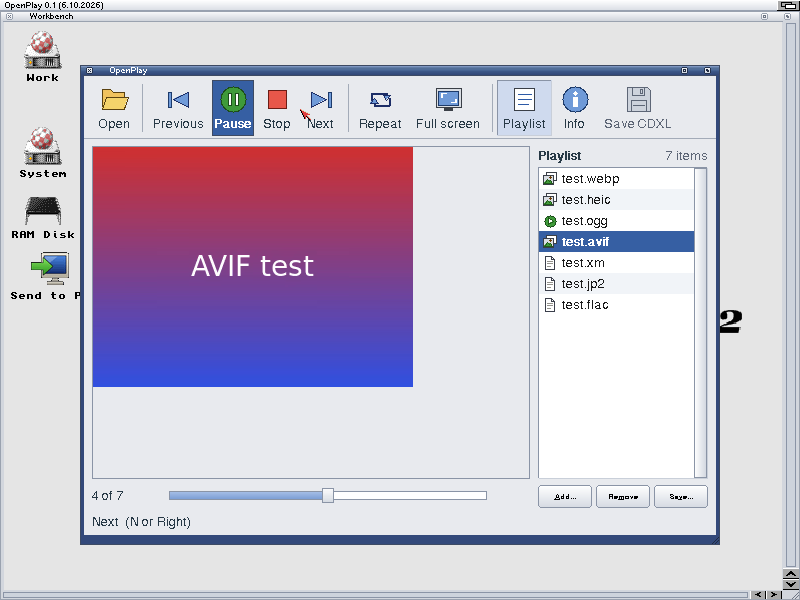

# OpenPlay

The Open media player for AmigaOS 3.2: pictures, sounds, tunes and films,
anything a datatype opens, in one window drawn with OpenGadTools in the
user's OpenLook theme. A new datatype is a new format for OpenPlay, with
nothing else to install.

We, 6 October 2026: "we will need a cool media player for this, that shows
off the datatypes and the new opengadtools interface and open rtg".

- **One window:** a toolbar, the picture or film, the position, a playlist
  and a status line that says which datatype opened the file and what decoded
  it (this Amiga, or the Nursery: the services card or a paired Cradle).
- **Buttons as icons and text, icons, or text,** from OpenPrefs Look, View ›
  Buttons, or a `BUTTONS=` ToolType (Open Apps Look and Feel).
- **Pictures play as a slideshow;** sounds and films play, pause and stop.
- **About this file** shows the datatype, the decoder, the screen and the
  time it took to open, and copies it to the clipboard.
- **Full screen** on a screen of its own (OpenRTG scales it on the board),
  and **View › Own screen** for the whole player.
- **Save CDXL** turns a film into a CDXL the chipset plays by itself, with
  ToCDXL (openamigaservice), for an AGA Amiga.
- **Drag and drop:** files and drawers dropped on the window join the
  playlist. Playlists save as `.opl` and open `.m3u`.

Status, 6 October 2026: 0.1, built and tested on AmigaChrome with OS 3.2.3.
Pictures, sound and tunes play. Films open, but playing them waits on a fix in
openvideo.datatype (openamigaimage).

## Building

    OGT=path/to/opengadtools ./build.sh      # build/os3/OpenPlay

It needs the os32 stove (m68k-amigaos-gcc, NDK 3.2) and OpenGadTools' sources
(`DalsinAI/opengadtools`, with the player icons). 68020 and up, integer maths
only. OpenUp installs it as a part (SYS:Utilities/OpenPlay).

## Using it

    OpenPlay [FILES ...] [BUTTONS=ICONS|TEXT|BOTH] [OWNSCREEN]

From Workbench: double-click it, shift-click files with it, or drop files on
its window. Keys: O open, P or Space play/pause, T or Esc stop, V and N (or
the cursor keys) previous and next, R repeat, F full screen, L playlist,
I about this file, C save CDXL, A add, M remove.

`OPENPLAY_DEBUG` set to a file's name writes a line for each step there.

## Licence

MIT, Copyright (c) 2026 Dalsin Limited (`LICENSE`). If you use or build on
this work, we ask (we do not require) that you credit Dalsin Limited and
AmigaChrome.
